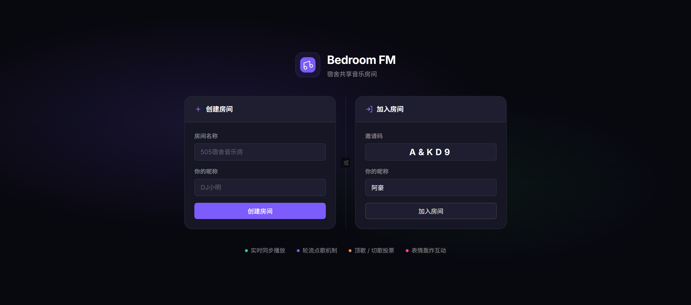
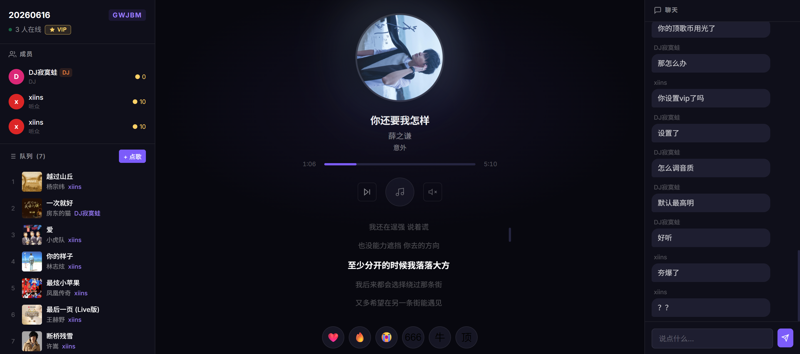

# BedroomFM

宿舍共享听歌应用 —— 创建房间，一起点歌，实时同步播放。

## 截图




## 技术栈

| 层 | 技术 |
|---|---|
| 前端 | Vue 3 + Vite + Pinia + Vue Router |
| 后端 | Go + Gin |
| 实时通信 | WebSocket (gorilla/websocket) |
| 音乐源 | 网易云音乐 (NeteaseCloudMusicApi) |

## 功能

- **房间制** —— 创建房间生成邀请码，室友输入邀请码加入
- **点歌队列** —— 搜索网易云歌曲加入队列，轮转排序避免一人霸榜
- **实时同步** —— 房主控制播放/暂停/切歌，所有成员同步收听
- **顶歌投票** —— 每人 10 个顶歌币，票数高的歌曲自动提前
- **切歌投票** —— 超过 50% 成员投票即可跳过当前歌曲
- **弹幕聊天** —— 实时聊天消息 + 弹幕飘屏
- **表情轰炸** —— 底部表情栏发送飘浮动画表情
- **歌词显示** —— 同步滚动歌词
- **VIP 解锁** —— 支持网易云扫码登录或 Cookie 导入，解锁 VIP 歌曲
- **移动端适配** —— 底部 Tab 导航切换队列/播放/聊天

## 快速开始

### 前置依赖

- Go 1.25+
- Node.js

网易云 API 默认使用公共代理 `http://iwenwiki.com:3000`，无需额外搭建。如需使用私有实例，设置 `NETEASE_API` 环境变量即可。

### 启动

```bash
# 1. 启动后端
cd backend
go run main.go

# 2. 启动前端
cd frontend
npm install
npm run dev
```

## 项目结构

```
├── backend/
│   ├── main.go                    # 入口
│   └── internal/
│       ├── api/handlers.go        # HTTP + WebSocket 处理
│       ├── hub/hub.go             # WebSocket Hub / Client
│       ├── models/models.go       # 数据模型
│       └── music/netease.go       # 网易云 API 封装
├── frontend/
│   └── src/
│       ├── views/
│       │   ├── Home.vue           # 首页（创建/加入房间）
│       │   └── Room.vue           # 房间页（播放/队列/聊天）
│       ├── stores/room.js         # Pinia 状态管理 + WebSocket
│       ├── router/index.js        # 路由
│       └── style.css              # 全局样式
└── 产品设计.md                     # 产品设计文档
```

## 环境变量

### 后端

| 变量 | 默认值 | 说明 |
|---|---|---|
| `PORT` | `8080` | 后端监听端口 |
| `NETEASE_API` | `http://iwenwiki.com:3000` | 网易云 API 代理地址（公共实例，开箱即用） |
| `NETEASE_COOKIE` | (空) | 全局 VIP Cookie 回退 |

### 前端

| 变量 | 默认值 | 说明 |
|---|---|---|
| `VITE_API_BASE` | `http://localhost:8080` | 后端 API 地址 |

## API 概览

### REST

| 方法 | 路径 | 说明 |
|---|---|---|
| POST | `/api/room/create` | 创建房间 |
| POST | `/api/room/join` | 通过邀请码加入房间 |
| GET | `/api/room/:id` | 获取房间状态 |
| GET | `/api/music/search?q=` | 搜索歌曲 |
| GET | `/api/music/url?id=&cookie=` | 获取播放链接 |
| GET | `/api/music/lyric?id=` | 获取歌词 |
| GET | `/api/music/login/qr/key` | 获取扫码登录 Key |
| GET | `/api/music/login/qr/create?key=` | 生成登录二维码 |
| GET | `/api/music/login/qr/check?key=` | 轮询扫码状态 |

### WebSocket

连接：`ws://localhost:8080/ws/:roomId?memberId=xxx`

| 客户端 → 服务端 | 说明 |
|---|---|
| `chat` | 发送聊天消息 |
| `queue_add` | 添加歌曲到队列 |
| `queue_remove` | 从队列移除歌曲 |
| `vote_up` | 顶歌 (+1/+3/+5) |
| `vote_skip` | 发起/参与切歌投票 |
| `reaction` | 发送表情 |
| `playback_sync` | 房主同步播放状态 |
| `next_song` | 切下一首 |

| 服务端 → 客户端 | 说明 |
|---|---|
| `room_state` | 完整房间状态 |
| `chat` | 聊天消息 |
| `reaction` | 表情反应 |
| `playback_sync` | 播放同步 |
| `skip_vote_update` | 切歌投票更新 |
| `member_join` / `member_leave` | 成员进出 |

## License

MIT
